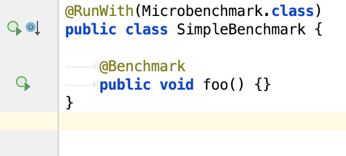

Microbenchmark Runner
=====================

Microbenchmark Runner is a JUnit (JUnit 4.12/JUnit 5 (Jupiter)) extension to run JMH benchmarks using JUnit directly by using existing JUnit integrations.

Typically, JMH benchmarks are launched using the JMH runner or a tool chain plugin such as Maven or Gradle. This is the ideal approach for JMH benchmark automation. The missing bit in JMH tooling is proper IDE support to selectively run JMH benchmarks when working on benchmarks.

Here is a quick teaser of a what Microbenchmark Runner can do for you:

```java
@RunWith(Microbenchmark.class)
public class SimpleBenchmark {

	@Benchmark
	public void foo() {}
}
```

Decorate your JMH benchmark with `@RunWith(Microbenchmark.class)`. Now you're able to leverage your IDE to start JMH benchmarks without fighting the command line.  




# Reporting Issues

Microbenchmark Runner uses GitHub’s integrated issue tracking system to record bugs and feature requests. If you want to raise an issue, please follow the recommendations below:

* Before you log a bug, please search the issue tracker to see if someone has already reported the problem.
* If the issue doesn’t already exist, create a new issue.
* Please provide as much information as possible with the issue report, we like to know the version of Microbenchmark Runner that you are using, as well as your Operating System and JVM version.
* If you need to paste code, or include a stack trace use Markdown \`\`\` escapes before and after your text.
* If possible try to create a test-case or project that replicates the issue. 

# Building from Source

If you want to try out the latest and greatest, Microbenchmark Runner can be easily built with the [maven wrapper](https://github.com/takari/maven-wrapper). You also need JDK 1.8.

```
$ ./mvnw clean install
```

# License

Microbenchmark Runner is Open Source software released under the [Apache 2.0 license](http://www.apache.org/licenses/LICENSE-2.0.html).
